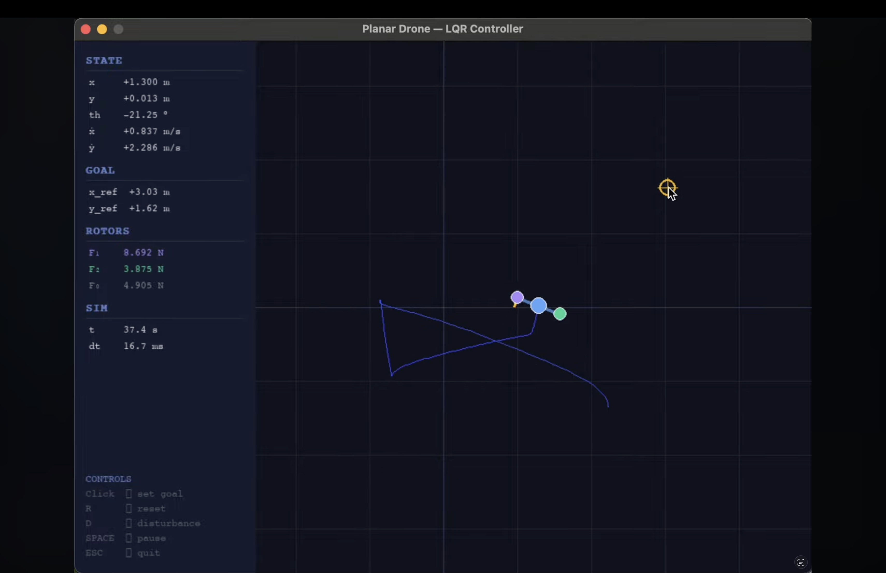
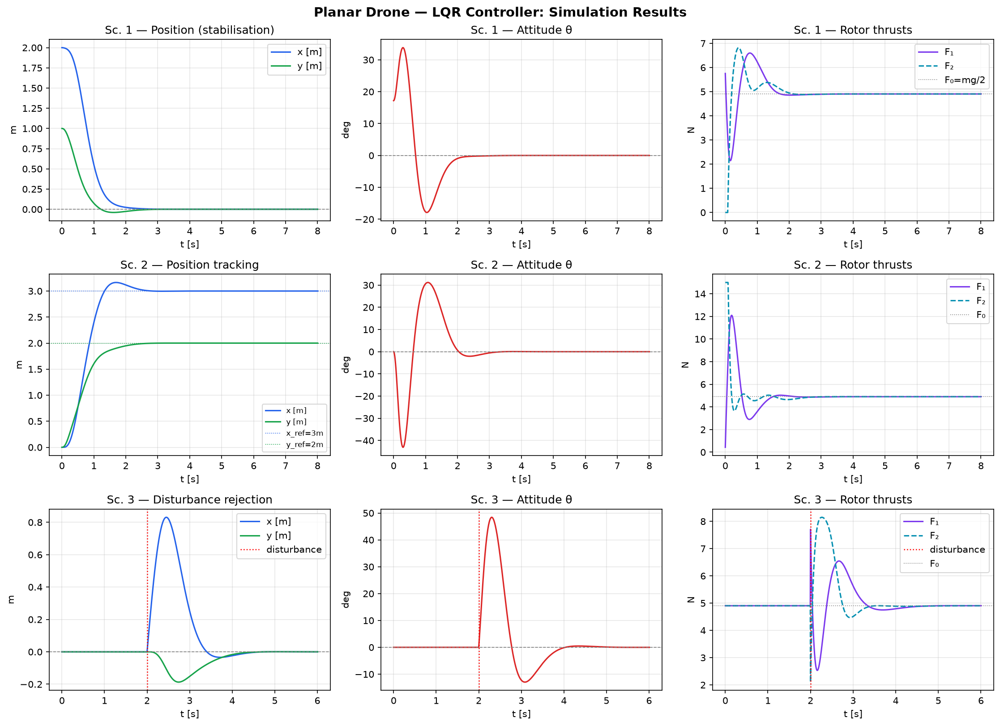
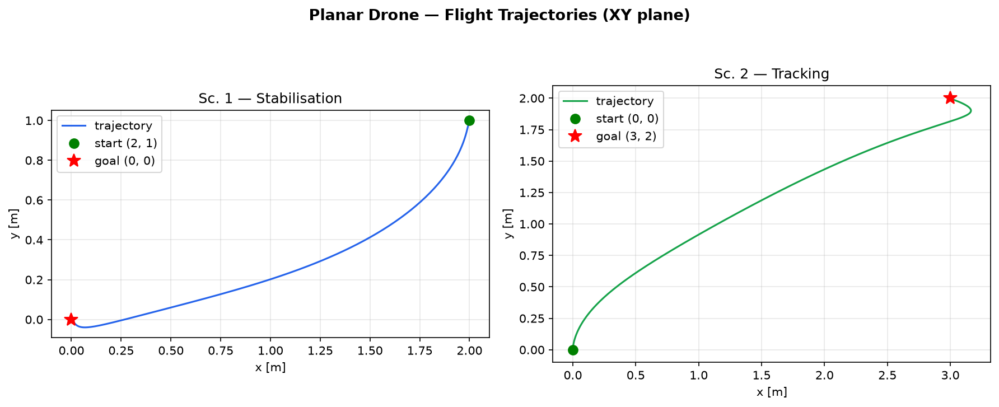

# 🎛️ Control Theory Project (Python)

### Planar Drone — LQR Controller

[](https://youtu.be/c-Osc7hJzVg)
[](https://www.python.org/)
[](https://scipy.org/)
[](https://www.pygame.org/)

A 2D quadrotor (planar drone) modeled from first principles and stabilized with a Linear Quadratic Regulator: nonlinear Newton-Euler equations of motion, linearization around the hover equilibrium, controllability analysis, and an LQR gain computed by solving the continuous-time algebraic Riccati equation. Solo project for the **Control Theory of Continuous and Discrete Event Processes** course at Poznań University of Technology.



## Demo

▶️ **[Watch on YouTube](https://youtu.be/c-Osc7hJzVg)** — the interactive Pygame simulation, LQR-controlled drone flying to clicked goal positions live.

## The system

The drone is a rigid body with two rotors producing vertical thrust, free to translate in a vertical plane (x, y) and rotate about its center of mass (pitch θ) — two inputs, three degrees of freedom, so the system is **underactuated**: it must tilt to move sideways.

```
mẍ = -(F₁ + F₂) sin(θ)
mÿ = (F₁ + F₂) cos(θ) - mg
Iθ̈ = L(F₁ - F₂)
```

Linearizing around hover (θ ≈ 0) gives an LTI system `δq̇ = A δq + B δu`. The controllability matrix `[B, AB, A²B, A³B, A⁴B, A⁵B]` has full rank 6, so the linearized system is fully controllable and LQR applies.

## Controller design

```python
Q = np.diag([20.0, 2.0, 20.0, 2.0, 15.0, 1.0])   # state cost
R = np.diag([0.5, 0.5])                           # control effort cost

P = solve_continuous_are(A, B, Q, R)               # algebraic Riccati equation
K = np.linalg.inv(R) @ B.T @ P                     # optimal gain

u = u_hover - K @ (state - goal_state)              # control law
```

All six closed-loop eigenvalues of `A - BK` land in the left half-plane, confirming stability:

```
-6.9509+0.0000j   -3.7601+0.0000j
-2.6647±2.5155j   -2.5440±1.5723j
```

The nonlinear model is integrated with RK4 and the resulting rotor thrusts are clamped to `[0, 15] N` — the same LQR gain, computed once, drives all three simulated scenarios below.

## Results

Three scenarios, simulated on the full nonlinear dynamics (not just the linearization):

| Scenario | Setup | Outcome |
|---|---|---|
| **1 — Stabilisation** | Start at (2, 1) m, 0.3 rad tilt, drive to hover at origin | Converges to origin, pitch returns to 0° |
| **2 — Tracking** | Step reference from hover to (3, 2) m | Settles at the new goal with bounded overshoot |
| **3 — Disturbance rejection** | Velocity + angular-rate impulse kick at t=2s | Recovers to hover within a few seconds |





Full derivation — equations of motion, linearization, Riccati solution, and a practical-feasibility discussion (sensor/actuator requirements, sampling rate, model mismatch, real-world implementation path) — is in the [project report](docs/report/Planar_Drone_LQR_Report.pdf).

## Code

- **[`src/lqr_analysis_and_plots.py`](src/lqr_analysis_and_plots.py)** — derives `A`/`B`, solves the Riccati equation for `K`, runs all three scenarios with an RK4 integrator, and produces the figures above.
- **[`src/drone_pygame_sim.py`](src/drone_pygame_sim.py)** — interactive real-time version of the same model and controller: click to set a new goal, watch the LQR-controlled drone fly to it live.

```
Controls (drone_pygame_sim.py):
    Click anywhere  — set new goal position
    R               — reset drone to start
    D               — apply random disturbance
    SPACE           — pause / resume
    ESC             — quit
```

## Limitations & future work

- Linearization is only valid for small pitch angles; large-angle maneuvers would need feedback linearization or MPC.
- No aerodynamic drag or actuator dynamics modeled.
- Full state feedback is assumed — a real implementation would need a state estimator (LQG / Kalman filter) for noisy sensors.

## Run it

```bash
pip install -r requirements.txt
python src/lqr_analysis_and_plots.py   # regenerate report figures
python src/drone_pygame_sim.py         # interactive simulation
```

## Repository structure

```
.
├── src/
│   ├── lqr_analysis_and_plots.py   # controller design, 3 scenarios, report figures
│   └── drone_pygame_sim.py          # interactive real-time simulation
├── docs/
│   ├── images/                       # simulation results, trajectories
│   └── report/                        # full project report (PDF)
├── requirements.txt
└── README.md
```

## Author

**Oskar Jabłonowski** — Automatic Control and Robotics, Poznań University of Technology

## License

[MIT](LICENSE)
